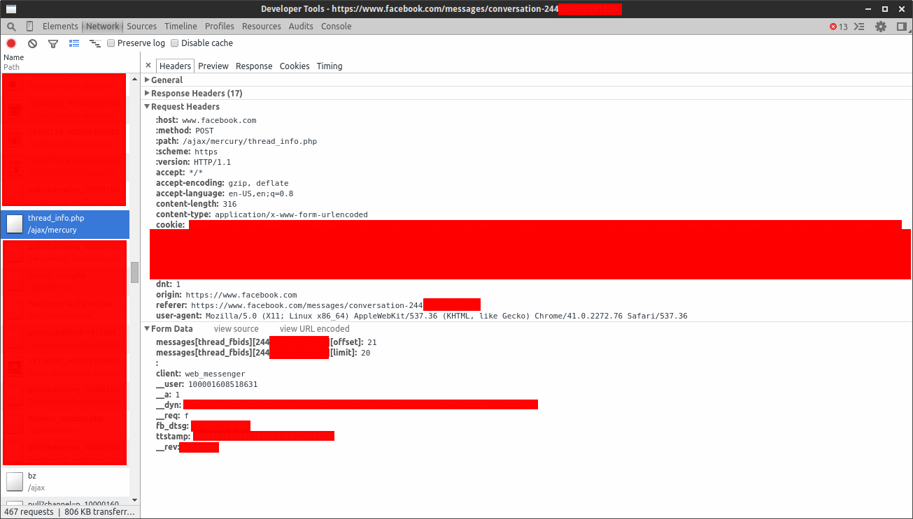

NicePhoneme
===========

Markov chains and chat statistics for Facebook Chat.

Requirements
------------

* [Python 3](https://www.python.org/downloads/) - used for running the scripts.
* [Google Chrome](https://www.google.com/chrome/)/[Chromium](https://www.chromium.org/Home) - used for obtaining Facebook sessions.
* [TextBlob](https://pypi.python.org/pypi/textblob) (optional) - used for sentiment analysis in statistical calculations.
* [MatPlotLib](http://matplotlib.org/) (optional) - used for plotting various relationships.

Workflow
--------

### Downloading the data from Facebook

The first thing to do is to actually get the data, from Facebook. Although Facebook provides a data dump, this is very incomplete - rich media in chats is not preserved, group chats don't show up at all, and the chat history is very limited.

NicePhoneme has a Facebook Chat importer that can download all the messages from a Facebook chat. This is the `message_downloader.py` script.

The typical workflow for downloading all messages from a Facebook conversation into a JSON file dump looks something like the following:

1. Open **Google Chrome** or **Chromium** to the [https://www.facebook.com/messages/](https://www.facebook.com/messages/), and navigate to the desired conversation.
2. Press **F12** or **right-click and select "Inspect Element"** to open the Developer Tools.
3. In the developer tools, go to the Network tab. Refresh the webpage.
4. Scroll down the long list of requests and select any request to `thread_info.php` at `/ajax/mercury` - the path `/ajax/mercury/thread_info.php`.
5. Select the `Headers` tab in the right pane.
6. Press Control + A to select all, and then copy (Control + C).
7. Open `message_downloader.py` in a text editor.
8. Replace everything on the lines between `request_info = """` on line 8 and `"""` on line 41 (but not those lines themselves) with the clipboard - paste the previously copied value overwriting the value there previously.
9. Run the script in the command line using Python 3, redirecting the output to a file: `python3 message_downloader.py > SOME_OUTPUT_FILE.json`. The script will use your current Facebook session in Chrome to download chat messages.

This script works for personal (one-on-one) conversations and group conversations. Here is an example of a `/ajax/mercury/thread_info.php` request for a group conversation:

Basically, open the Developer Tools console to that request, select all, and copy/paste that into the specified location in `message_downloader.py`.

See `example_download_messages.sh` for an example script invocation.

If you followed the steps above, the data dump will now be stored in `SOME_OUTPUT_FILE.json`. It is basically a JSON array of message objects (one per line), and has the following form:

    [
    {"attachments": [], "forward_count": 0, "other_user_fbid": null, "thread_id": "id.244208602353745", "timestamp_relative": "Sat", "is_filtered_content": false, "is_unread": false, "author": "fbid:100001608518631", "author_email": "100001608518631@facebook.com", "coordinates": null, "source": "source:chat:web", "forward_message_ids": [], "has_attachment": false, "folder": "inbox", "subject": null, "message_id": "mid.1417251353723:a10628342dc4aecf23", "html_body": null, "body": "what message body", "source_tags": ["source:chat"], "timestamp": 1419660501532, "timestamp_datetime": "Saturday 1:08am", "threading_id": null, "ranges": [], "timestamp_time_passed": 1, "is_forward": false, "raw_attachments": null, "action_type": "ma-type:user-generated-message", "is_spoof_warning": false, "action_id": "1417251353723", "timestamp_absolute": "Saturday", "thread_fbid": "244208602353745"},
    <...MORE ENTRIES...>
    ]

Notes about running the script (Step 8):

* This step will take a while to complete, as it waits several seconds between each request to avoid being blocked.
* The script will download the messages in the conversation starting from the most recent messages and working backwards toward the oldest.
* Sometimes downloading a chunk of messages will fail (especially when it gets very far back in the history, where a 70% failure rate is normal).
    * Upon failure, the script will retry the download until it succeeds.
    * After a certain point (around 100 thousand messages back), Facebook simply won't return the chat data. When this is the case, the chat script will keep retrying forever.
    * If the script takes too many retries, you might want to stop it and just get the results it has obtained so far. Do this by sending a keyboard interrupt (on most systems, this is **Control + C** in the command line).

### Normalizing the data

Right now, the data is rather unwieldy to work with, since the message entries contain a lot of noise and not-very-useful fields. We will now perform normalization on the data to get it into a more readable and workable form. This can be done using the `normalize_data.py` script.

Simply run the script with the downloaded Facebook chat JSON dump as input, and it will output the normalized data. For example, running `python3 normalize_data.py < SOME_DATA_DUMP.json > SOME_OUTPUT_FILE.json` in the terminal will read `SOME_DATA_DUMP.json`, and output the normalized version to `SOME_OUTPUT_FILE.json`.

If there are two or more users with the exact same name, it is often helpful to give each user a different nickname. To do this, simply edit the `user_aliases` dictionary at the top of the script source code. This is a mapping between Facebook user identifiers of the form `fbid:<POSITIVE_INTEGER>` and names, or between names and other names. Names will be retrieved via the [Facebook Graph API](https://developers.facebook.com/docs/graph-api).

See `example_normalize_data.sh` for an example script invocation.

The JSON in the previous section results in JSON output of the following form:

    [
    [1419660501532, "Anthony Zhang", "what message body", []]
    <...MORE ENTRIES...>
    ]

Notes about the format:

* The first field is the UNIX millisecond timestamp for when the message was sent - the number of milliseconds since midnight January 1, 1970.
* The second field is the author of the message, as given in the `normalize_data.py` script.
* The third field is the message body - the text of the message.
* The fourth field is an array of attachments associated with the message - stickers, photos, files, GPS locations, and more.
    * Each attachment is a string that begins with the type of attachment, a colon, and then the attachment information (generally a URL).
    * A location will have the form "location:<LATITUDE>,<LONGITUDE> ~<ACCURACY>m".
    * A photo, sticker, or video will have the form "photo:<URL_FOR_PHOTO>", "sticker:<URL_FOR_STICKER_IMAGE>", "video:<URL_FOR_VIDEO>".

### Summarizing the data

To get an overall feel for the data, we might want to calculate some statistics for it. This can be done using the `statistics.py` script.

Run this script with the normalized data as input, and it will output various statistics such as word frequencies, expletive usage, and so on. If [TextBlob](https://pypi.python.org/pypi/textblob) is installed, it will also perform sentiment analysis for each user. For example, `python3 markov_generate.py < SOME_NORMALIZED_DATA.json` will calculate statistics for the given message data.

See `example_get_statistics.sh` for an example script invocation.

### Generating arbitrary text using Markov chains

To generate messages that "sound" like a particular text corpus, we can use Markov models. The `markov_generate.py` script implements this.

Run this script with the normalized data as input, and it will output messages generated by a Markov model trained on the message data. The script accepts 1 or 2 parameters. The first is the number of messages to generate. The second, optional parameter is the name of the user to filter by, and if not specified, the script will not filter at all.

For example, `python3 markov_generate.py 300 "Anthony Zhang" < SOME_NORMALIZED_DATA.json` will generate 300 messages using a Markov model trained on the messages written by the user `"Anthony Zhang"` in the given message data, and `python3 markov_generate.py 300 < SOME_NORMALIZED_DATA.json` will generate 300 messages using a Markov model trained on all the messages.

See `example_markov_generation.sh` for an example script invocation.

### Plotting chat activity over time

To generate plots of chat activity over time, we can use [MatPlotLib](http://matplotlib.org/). The `plot_usage.py` script implements this.

Run this script with the normalized data as input, and it will open a MatPlotLib plot relating unique user message frequency to time (multiple messages from the same user are treated as one message).

For example, `python3 plot_usage.py < SOME_NORMALIZED_DATA.json` will generate a message frequency over time plot for the given message data.

See `example_plot_usage.sh` for an example script invocation.
